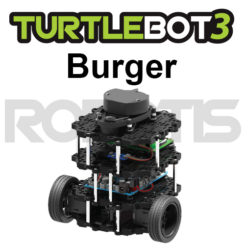
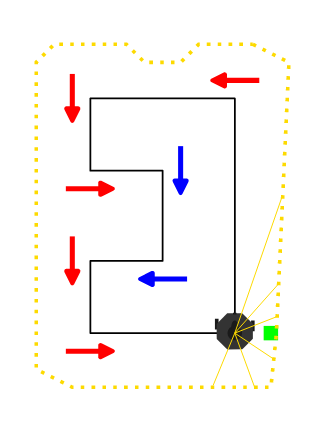
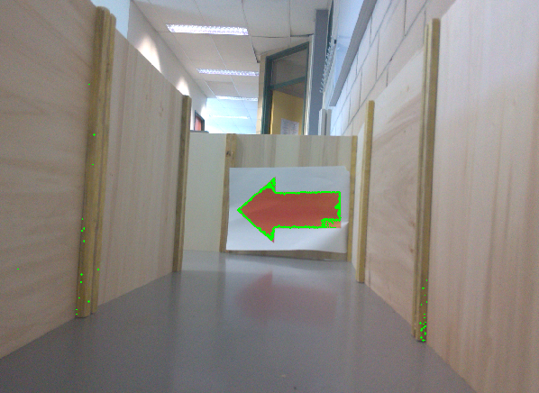
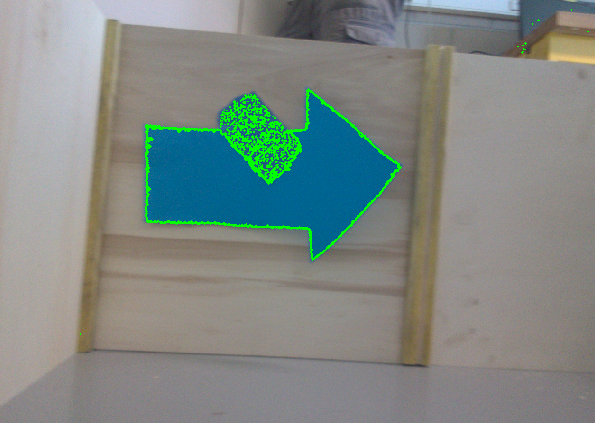
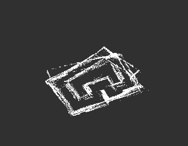

# dedale

Le résultat d'un travail en binôme réalisé au semetre de printemps 2023, à l'UTC dans le cadre de l'UV SY31.

## Objectifs

Ce code est codé en Python avec la bibliothèque ROS et permet de contrôler un Turtlebot.



Il permet de mettre un robot dans un labyrinthe, d'utiliser la caméra du robot pour détecter des flèches rouges ou bleues, et de faire en sorte que notre terminal renvoie "Tourner à gauche" quand une flèche rouge est suffisamment près, ou "Tournez à droite" quand une flèche bleue est suffisamment près. Le contrôle du déplacement du robot se fait manuellement.





De plus, il permet de cartographier le labyrinthe à l'aide du Lidar du robot.



## Lancer le projet

```bash
roslaunch turtlebot3_teleop turtlebot3_teleop_key.launch # Faire avancer le robot
roslaunch parcours parcours.launch # Lancer un ensemble de noeuds
```

## Pistes d'amélioration

Le principal défaut de ce projet est qu'il fonctionne dans les conditions précises du labyrinthe où on ne croiserait qu'une flèche à chaque fois. De plus, il faut des conditions de luminosité égales pour toutes les flèches, autrement, nous n'arrivons pas à détecter entièrement la surface colorée, or c'est elle qui nous permet de déterminer quand nous sommes assez proches pour tourner. Une solution à ce problème serait d'utiliser le Lidar (ou le capteur ultrason) pour obtenir la distance du robot à la flèche. Enfin, tous les points du Lidar sont stockés, il faudrait enlever les doublons, ou utiliser une autre méthode de stockage (par exemple, découper l'espace en quadrillage et stocker une probabilité qu'une case soit vide).

## Contributrices

* Emma Falkiewitz
* Laura Miguel
